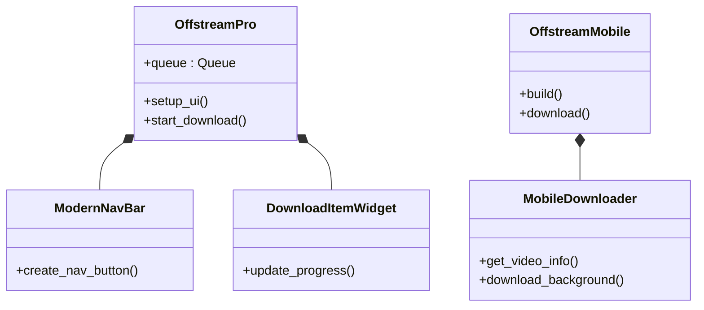

<div align="center">
  
  
  # Offstream
  
  **Your Premium Media Downloader for Windows & Mobile**
  
  [](https://opensource.org/licenses/MIT)
  [](https://www.python.org/downloads/)
  [](https://kivy.org/)
  [](https://pypi.org/project/PySide6/)

  [🇧🇷 Português](README_PT.md) | [🇺🇸 English](README.md)
  
</div>

---

### 📖 Documentation / Documentação
| [CODE OF CONDUCT](CODE_OF_CONDUCT.md) | [CONTRIBUTING](CONTRIBUTING.md) | [SECURITY](SECURITY.md) |
| :---: | :---: | :---: |
| [CÓDIGO DE CONDUTA](CODE_OF_CONDUCT_PT.md) | [CONTRIBUINDO](CONTRIBUTING_PT.md) | [SEGURANÇA](SECURITY_PT.md) |

---

## 📸 Screenshots

<div align="center">
  <!-- Place the user provided screenshot here -->
  
</div>

## 🧩 Architecture



## 🚀 Features

- **Multi-Platform**: Desktop (Windows) and Mobile (Android).
- **High Quality**: Downloads up to 4K/8K.
- **Spotify Support**: Download songs and playlists directly.
- **Smart Queue**: Manage multiple downloads simultaneously.
- **Modern UI**: Sleek dark mode interface.

## 🛠️ Installation

### Desktop (Windows)
1. Clone the repository:
   ```bash
   git clone https://github.com/joaoportolan93/Video-downloader.git
   cd Video-downloader
   ```
2. Create a virtual environment:
   ```bash
   python -m venv .venv
   .venv\Scripts\activate
   ```
3. Install dependencies:
   ```bash
   pip install -r requirements.txt
   ```
4. Run the application:
   ```bash
   python app.py
   ```

### Mobile (Android)
Requires [Buildozer](https://buildozer.readthedocs.io/en/latest/) (Linux/WSL).
```bash
cd mobile
buildozer android debug
```

## 🤝 Contributing

Contributions are welcome! Please read our [Contributing Guidelines](CONTRIBUTING.md) for details.

## 📄 License

This project is licensed under the MIT License - see the [LICENSE](LICENSE) file for details.