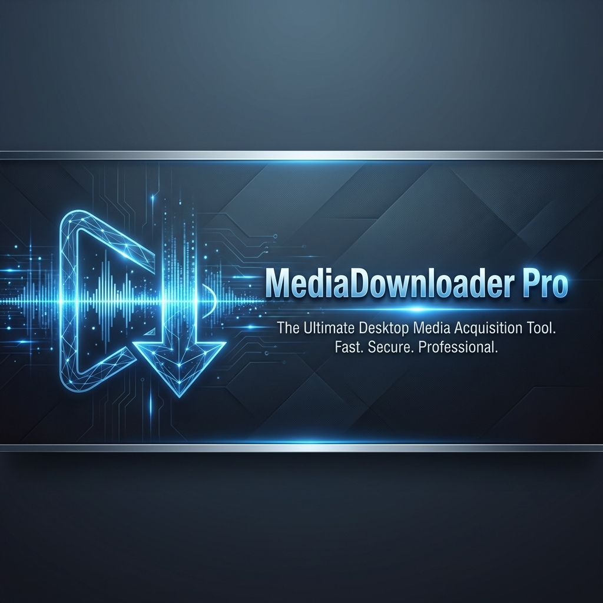

<div align="center">
  
  
  <p>
    <b>Forge Your Offline Media Collection</b>
  </p>

  <p>
    <a href="https://www.python.org/">
      
    </a>
    <a href="https://qt.io/">
      
    </a>
    <a href="https://github.com/yt-dlp/yt-dlp">
      
    </a>
    <a href="https://github.com/spotDL/spotdl">
      
    </a>
     <a href="LICENSE">
      
    </a>
  </p>
</div>

---

## 🎭 What is MediaDownloader Pro?

**MediaDownloader Pro** is a powerful and modern desktop application designed to grant you control over your media. Whether it's high-definition videos from YouTube or your favorite playlists from Spotify, MediaDownloader Pro handles it all with a sleek, user-friendly interface.

Built with **Python** and **PySide6**, it combines the robustness of command-line tools like `yt-dlp` and `spotdl` with the ease of use of a GUI, featuring dark mode, queue management, and batch processing.

## 🌟 Features

### 🎯 Core Capabilities
- **Multi-Platform Support**: Seamlessly download content from **YouTube** and **Spotify**.
- **High Quality Formats**: 
  - Video: MP4, WEBM (up to 1080p).
  - Audio: MP3 (320kbps), WAV (Lossless).
- **Smart Detection**: Automatically detects if a URL is a single track/video or a full playlist/album.

### ⚡ Power User Tools
- **Batch Processing**: Configurable concurrent downloads (download multiple files at once).
- **Queue System**: View active downloads, pause, resume, or cancel operations.
- **History & Favorites**: Keep track of what you've downloaded and save your favorite links for quick access.

### 🎨 Modern Experience
- **Sleek UI**: Material-inspired design with a native Dark Mode.
- **Responsive**: Adaptive layout that fits your workflow.
- **No Ads**: Clean, distraction-free interface.

## 🏗️ Tech Stack

<div align="center">

| Component | Technology | Description |
| :--- | :--- | :--- |
| **Language** |  | Core logic and backend processing. |
| **GUI Framework** |  | **PySide6** for a native, high-performance interface. |
| **Video Engine** |  | Advanced YouTube download handling. |
| **Audio Engine** |  | High-quality Spotify downloader. |
| **Processing** |  | Media conversion and metadata embedding. |

</div>

## 🚀 Getting Started

Follow these steps to set up MediaDownloader Pro on your machine.

### Prerequisites

- **Python 3.8** or higher.
- **FFmpeg**: Required for media conversion.
  - *Windows*: Download and add to PATH.
  - *Linux*: `sudo apt install ffmpeg`
  - *macOS*: `brew install ffmpeg`

### 📦 Installation

1. **Clone the repository**
   ```bash
   git clone https://github.com/joaoportolan93/Video-downloader.git
   cd Video-downloader
   ```

2. **Install dependencies**
   ```bash
   pip install -r requirements.txt
   ```

3. **Install spotDL (Optional, for Spotify support)**
   ```bash
   pip install spotdl
   ```

### 🎮 Usage

Run the application:
```bash
python app.py
```

1. Paste a YouTube or Spotify URL.
2. Click **"Verificar URL"** to fetch metadata.
3. Select your desired format and quality.
4. Click **"⬇️ Download"**!

## 🤝 Contributing

Contributions are welcome! If you have ideas for new features or bug fixes:

1. Fork the project.
2. Create your feature branch (`git checkout -b feature/AmazingFeature`).
3. Commit your changes (`git commit -m 'Add some AmazingFeature'`).
4. Push to the branch (`git push origin feature/AmazingFeature`).
5. Open a Pull Request.

## 📜 License

Distributed under the MIT License. See `LICENSE` for more information.

## 👨‍💻 Author

**João Portolan**

---

<div align="center">
  <sub>Built with ❤️ using Python and Qt</sub>
</div>