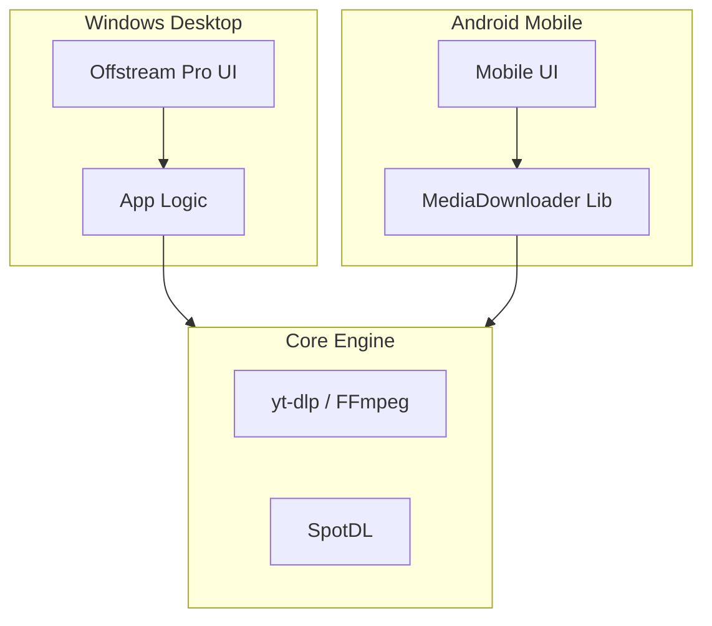

<div align="center">
  
  
  # Offstream
  
  **O Seu Downloader de Mídia Premium para Windows e Mobile**
  
  [](https://opensource.org/licenses/MIT)
  [](https://www.python.org/downloads/)
  
  [🇧🇷 Português](README_PT.md) | [🇺🇸 English](README.md)
  
</div>

---

### 📖 Documentação
| [CÓDIGO DE CONDUTA](CODE_OF_CONDUCT_PT.md) | [CONTRIBUINDO](CONTRIBUTING_PT.md) | [SEGURANÇA](SECURITY_PT.md) |
| :---: | :---: | :---: |

---

## 🌟 Sobre o Projeto

**Offstream** é um downloader de mídia poderoso e versátil, projetado para oferecer uma experiência perfeita ao baixar vídeos e áudios de várias plataformas. Construído com Python, PySide6 e Kivy, ele oferece uma interface moderna com tema escuro tanto para desktop (Windows) quanto para usuários móveis (Android).

Se você deseja salvar seus vídeos favoritos do YouTube em alta qualidade (até 4K/8K se o vídeo estiver disponível nessa qualidade) ou baixar playlists inteiras do Spotify diretamente no seu dispositivo, o Offstream lida com tudo isso com facilidade e estilo. Ele combina funcionalidade robusta com uma experiência de usuário premium, tornando o arquivamento de mídia simples e agradável.

## 🧩 Arquitetura



## 🚀 Funcionalidades

- **Multi-Plataforma**: Desktop (Windows) e Mobile (Android) (Obs: O app para mobile ainda está em desenvolvimento).
- **Alta Qualidade**: Downloads de até 4K/8K.
- **Suporte Spotify**: Baixe músicas e playlists diretamente.
- **Fila Inteligente**: Gerencie múltiplos downloads simultaneamente.
- **Interface Moderna**: UI elegante em modo escuro.

## 🛠️ Instalação

### Desktop (Windows)
1. Clone o repositório:
   ```bash
   git clone https://github.com/joaoportolan93/Video-downloader.git
   cd Video-downloader
   ```
2. Crie um ambiente virtual:
   ```bash
   python -m venv .venv
   .venv\Scripts\activate
   ```
3. Instale as dependências:
   ```bash
   pip install -r requirements.txt
   ```
4. Execute o aplicativo:
   ```bash
   python app.py
   ```

## 🤝 Contribuindo

Contribuições são bem-vindas! Leia nossas [Diretrizes de Contribuição](CONTRIBUTING_PT.md) para detalhes.

## 📄 Licença

Este projeto está licenciado sob a Licença MIT - veja o arquivo [LICENSE](LICENSE) para detalhes.
